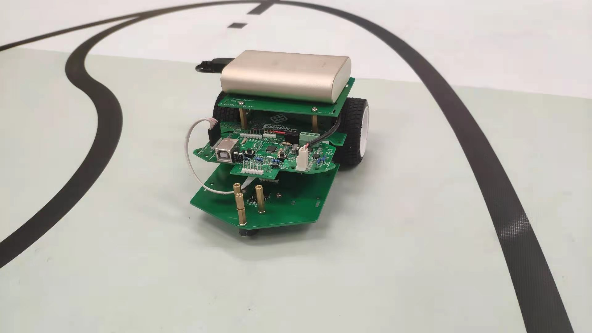
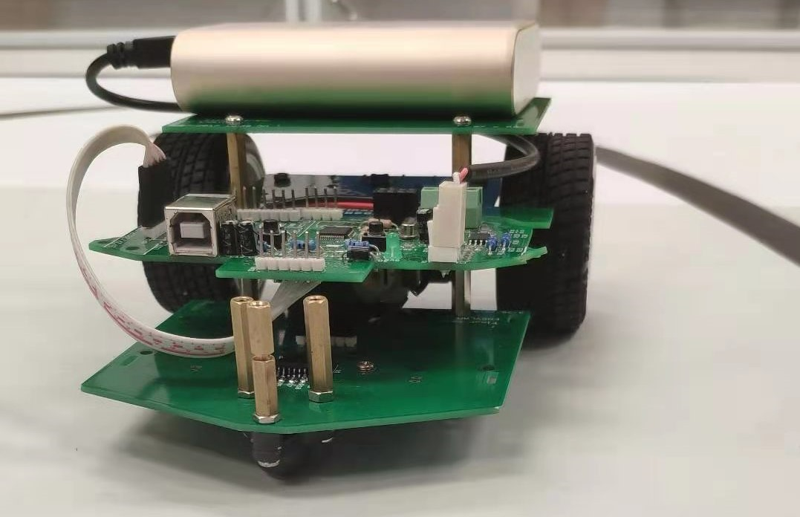

# PID-Controlled-Robot-Car
Apply the PID control method and build a robot car powered by stm32 MCU embedded with infrared sensors and WIFI modules to complete three different cars. 
 
 

 
 
## Demo2

